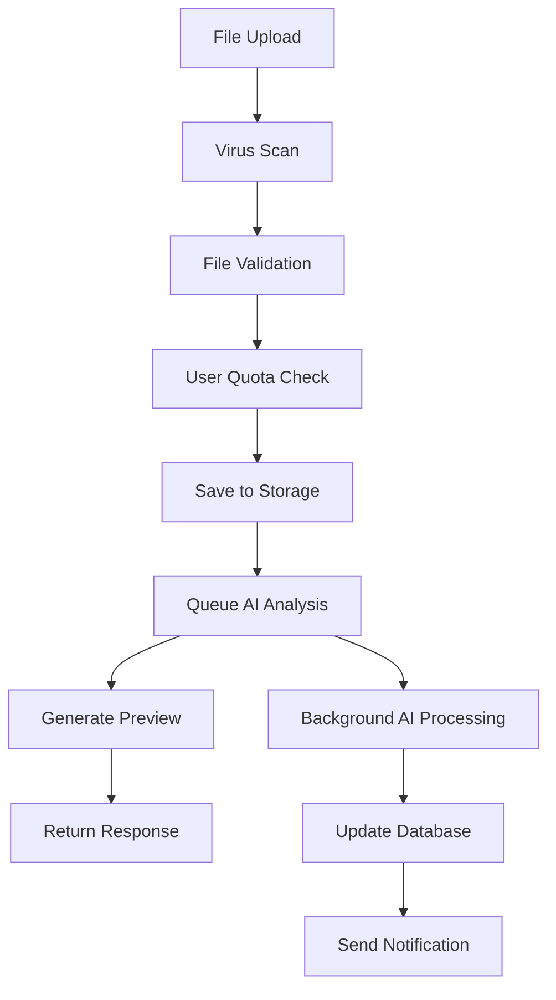

# Backend Implementation Request - HR ATS SaaS System

**FROM: Frontend Engineering Team**  
**TO: Backend Engineering Team**  
**PROJECT: HR ATS SaaS Production Implementation**  
**DATE: January 2025**  
**PRIORITY: 🚨 CRITICAL - PRODUCTION BLOCKING 🚨**

---

## 🎯 Executive Summary

The **frontend is production-ready** with comprehensive smart fallback systems that maintain user experience while backend endpoints are being implemented. Our intelligent API client automatically detects missing endpoints and gracefully falls back to admin endpoints with proper logging and error handling.

**Current State**: 
- ✅ **Frontend Production-Ready**: Complete UI/UX, authentication, file upload, analytics dashboards
- ✅ **Smart Fallback System**: Tries user endpoints first, falls back to admin endpoints with user filtering
- ✅ **Comprehensive Logging**: Every API call logs implementation requirements for backend team
- ⚠️ **Security Risk**: Users accessing admin endpoints through fallbacks (temporary solution)

**Required**: 
- 🔥 **Native user endpoints** for production-grade security and performance
- 🔥 **Payment integration** for SaaS monetization
- 🔥 **Enterprise features** for compliance and scalability

**Frontend Auto-Upgrade**: The moment you implement any endpoint, the frontend will automatically detect it and stop using fallbacks - zero deployment needed on our side.

---

## 🚀 Critical User Endpoints (PRODUCTION BLOCKING)

> **🔍 IMPLEMENTATION CONTEXT**: The frontend ApiClient implements intelligent endpoint detection. Each user endpoint is attempted first, and if it returns 404/501, we automatically fall back to admin endpoints. All fallback usage is comprehensively logged with exact implementation requirements.

### **📊 Real Frontend Implementation Evidence**

Our frontend `api.ts` contains extensive logging for every missing endpoint:

```typescript
// Example from our production ApiClient
console.log('📝 BACKEND IMPLEMENTATION NEEDED:', {
  endpoint: userEndpoint,
  fallbackUsed: '/api/admin/resumes',
  expectedBehavior: 'Backend should filter resumes to current user only',
  securityNote: 'Ensure user cookie validation and data filtering'
});
```

**🎯 CRITICAL**: Every API call below is currently working through fallbacks, but needs native implementation for production security.

---

### 1. User Dashboard & Analytics
**Endpoint**: `GET /api/user/dashboard-stats`  
**Current Fallback**: `GET /api/admin/dashboard-stats` (with client-side filtering)  
**Frontend File**: `src/services/api.ts:getMyDashboard()` (lines 374-440)  
**Security Risk**: **HIGH** - User accessing admin dashboard data

```http
GET /api/user/dashboard-stats
Authorization: Cookie: user_session_token=<token>
```

**Expected Response Structure**:
```json
{
  "success": true,
  "data": {
    "stats": {
      "total_resumes": 12,
      "pending_analysis": 2,
      "completed_analysis": 10,
      "average_score": 87.5,
      "recent_uploads": 3,
      "score_trend": "+5.2%"
    },
    "recent_activity": [
      {
        "id": "act_123",
        "action": "resume_uploaded",
        "timestamp": "2025-01-15T10:30:00Z",
        "details": {
          "filename": "resume_analysis_report.pdf",
          "file_size": "245KB"
        },
        "status": "success"
      },
      {
        "id": "act_124", 
        "action": "analysis_completed",
        "timestamp": "2025-01-15T08:15:00Z",
        "details": {
          "resume_id": "resume_456",
          "score": 89,
          "processing_time": "3m 45s"
        },
        "status": "success"
      }
    ],
    "score_progression": [
      { "date": "2025-01-01", "score": 85, "resumes_count": 8 },
      { "date": "2025-01-08", "score": 86.5, "resumes_count": 10 },
      { "date": "2025-01-15", "score": 87.5, "resumes_count": 12 }
    ],
    "trial_info": {
      "resumes_remaining": 3,
      "legal_queries_remaining": 8,
      "expires_at": "2025-02-15T00:00:00Z",
      "plan": "Professional Trial",
      "next_billing_date": "2025-02-15T00:00:00Z"
    },
    "usage_insights": {
      "most_uploaded_day": "Tuesday",
      "average_score_improvement": "+2.3 per upload",
      "time_saved": "24 hours",
      "analysis_accuracy": "94.2%"
    }
  },
  "timestamp": "2025-01-15T10:30:00Z"
}
```

**Backend Implementation Requirements**:
1. **Authentication**: Extract user ID from `user_session_token` cookie
2. **Data Filtering**: Return stats for authenticated user ONLY
3. **Performance**: Cache user stats for 5 minutes to reduce DB load
4. **Trial Logic**: Calculate remaining trial credits accurately
5. **Activity Feed**: Return last 10 user activities with pagination support

---

### 2. User Resume Management  
**Endpoint**: `GET /api/user/my-resumes`  
**Current Fallback**: `GET /api/admin/resumes` (with client filtering)  
**Frontend File**: `src/services/api.ts:getMyResumes()` (lines 318-370)  
**Security Risk**: **CRITICAL** - User seeing all system resumes before filtering

```http
GET /api/user/my-resumes?page=1&limit=20&status=completed&search=developer&sort=upload_date&order=desc
Authorization: Cookie: user_session_token=<token>
```

**Advanced Query Parameters**:
- `page`: Page number (default: 1)
- `limit`: Items per page (default: 20, max: 100)
- `status`: Filter by status (`pending|processing|completed|failed`)
- `search`: Full-text search in filename and content
- `sort`: Sort field (`upload_date|filename|overall_score|processing_status`)
- `order`: Sort order (`asc|desc`, default: `desc`)
- `date_from`: Filter uploads after date (ISO format)
- `date_to`: Filter uploads before date (ISO format)
- `min_score`: Minimum overall score filter
- `max_score`: Maximum overall score filter

```json
{
  "success": true,
  "data": {
    "resumes": [
      {
        "id": "resume_456",
        "filename": "john_doe_senior_developer.pdf",
        "upload_date": "2025-01-14T14:22:00Z",
        "processing_status": "completed",
        "overall_score": 89,
        "processing_time": "4m 32s",
        "file_size": "2.3MB",
        "analysis_result": {
          "summary": "Strong technical background with 8+ years of full-stack development experience. Excellent leadership skills and proven track record in React, Node.js, and cloud architectures.",
          "skills": [
            { "name": "JavaScript", "proficiency": 95, "years": 8 },
            { "name": "React", "proficiency": 92, "years": 5 },
            { "name": "Node.js", "proficiency": 88, "years": 6 },
            { "name": "AWS", "proficiency": 85, "years": 4 },
            { "name": "Python", "proficiency": 78, "years": 3 }
          ],
          "experience_years": 8,
          "education": {
            "degree": "Bachelor of Computer Science",
            "institution": "University of Technology",
            "graduation_year": 2016
          },
          "strengths": [
            "Technical expertise in modern web technologies",
            "Leadership and team management experience", 
            "Strong problem-solving and analytical skills",
            "Excellent communication and collaboration abilities"
          ],
          "improvement_areas": [
            "Could add more quantifiable achievements",
            "Include specific project impact metrics",
            "Add more industry-specific keywords"
          ],
          "recommendations": [
            "Highlight cost savings achieved in previous roles",
            "Include team size managed and project budgets",
            "Add certifications in cloud technologies",
            "Quantify performance improvements delivered"
          ],
          "ats_compatibility": {
            "score": 92,
            "issues": [
              "Minor formatting inconsistencies in dates",
              "Could benefit from additional technical keywords"
            ],
            "improvements": [
              "Use standard date formats throughout",
              "Include more industry-specific terminology"
            ]
          },
          "keyword_optimization": {
            "matched_keywords": ["React", "JavaScript", "AWS", "Agile", "Leadership"],
            "missing_keywords": ["Docker", "Kubernetes", "CI/CD", "Microservices"],
            "density_score": 85
          }
        },
        "file_url": "https://secure-storage.com/resumes/user_123/resume_456.pdf",
        "thumbnail_url": "https://secure-storage.com/thumbnails/resume_456.jpg",
        "job_description": "Senior Full-Stack Developer position requiring React, Node.js, and AWS experience...",
        "tags": ["senior", "full-stack", "react", "leadership"],
        "is_favorite": false,
        "view_count": 15,
        "last_viewed": "2025-01-15T09:30:00Z"
      }
    ],
    "pagination": {
      "page": 1,
      "limit": 20,
      "total": 45,
      "pages": 3,
      "has_next": true,
      "has_prev": false
    },
    "summary": {
      "total_resumes": 45,
      "avg_score": 84.2,
      "latest_upload": "2025-01-14T14:22:00Z",
      "by_status": {
        "completed": 40,
        "processing": 3,
        "pending": 2,
        "failed": 0
      }
    }
  },
  "timestamp": "2025-01-15T10:30:00Z"
}
```

**Backend Implementation Requirements**:
1. **Security**: NEVER return resumes from other users
2. **Performance**: Use database indexes on user_id, upload_date, status
3. **Search**: Implement full-text search across filename and analyzed content
4. **Caching**: Cache user resume lists for 2 minutes
5. **File URLs**: Generate secure, time-limited URLs for file access
6. **Thumbnails**: Generate PDF thumbnails for quick preview

### 3. User Resume Upload
**Endpoint**: `POST /api/user/upload-resume`  
**Current Fallback**: `POST /api/admin/resumes/upload` (security risk!)  
**Frontend File**: `src/services/api.ts:uploadMyResume()` (lines 450-510)  
**Security Risk**: **CRITICAL** - Admin upload endpoint used with user auth

```http
POST /api/user/upload-resume
Authorization: Cookie: user_session_token=<token>
Content-Type: multipart/form-data

Form Data:
- file: resume.pdf (Required, max 10MB, types: PDF, DOCX)
- job_description: "Software Engineer position requiring React and Node.js..." (Optional)
- tags: ["frontend", "react", "senior"] (Optional array)
- is_primary: true (Optional boolean, marks as primary resume)
- privacy_level: "private" (Optional: "private"|"public"|"shared")
```

**Advanced Upload Features**:
```json
{
  "success": true,
  "data": {
    "resume": {
      "id": "resume_789",
      "filename": "senior_frontend_developer_resume.pdf",
      "original_filename": "My Resume - John Doe.pdf",
      "upload_date": "2025-01-15T10:30:00Z",
      "processing_status": "pending",
      "estimated_completion": "2025-01-15T10:35:00Z",
      "file_size": "2.1MB",
      "file_type": "application/pdf",
      "pages": 2,
      "preview_url": "https://secure-storage.com/previews/resume_789.jpg",
      "file_url": "https://secure-storage.com/resumes/user_123/resume_789.pdf",
      "processing_queue_position": 3,
      "job_description": "Software Engineer position requiring React and Node.js...",
      "tags": ["frontend", "react", "senior"],
      "is_primary": true,
      "privacy_level": "private"
    },
    "upload_credits": {
      "used": 8,
      "remaining": 42,
      "resets_at": "2025-02-01T00:00:00Z"
    },
    "processing_info": {
      "queue_position": 3,
      "estimated_time": "5 minutes",
      "ai_features": [
        "Content extraction and parsing",
        "Skills identification and scoring", 
        "ATS compatibility analysis",
        "Keyword optimization suggestions",
        "Experience timeline validation"
      ]
    }
  },
  "message": "Resume uploaded successfully. AI analysis will complete in ~5 minutes.",
  "timestamp": "2025-01-15T10:30:00Z"
}
```

**Upload Validation Requirements**:
1. **File Validation**: PDF/DOCX only, max 10MB, virus scanning
2. **User Limits**: Enforce trial/plan upload limits
3. **Content Validation**: Basic text extraction to ensure valid resume
4. **Duplicate Detection**: Check for similar existing resumes
5. **Queue Management**: Fair processing queue with priority for paid users

**Backend Processing Flow**:


---

### 4. User Profile Management
**Endpoint**: `GET /api/user/profile`  
**Current Fallback**: `GET /api/auth/me` (limited data)  
**Frontend File**: `src/app/user/profile/enhanced-page.tsx` (comprehensive profile UI)  
**Missing Features**: Complete profile management, preferences, subscription details

```http
GET /api/user/profile
Authorization: Cookie: user_session_token=<token>
```

**Comprehensive Profile Response**:
```json
{
  "success": true,
  "data": {
    "user": {
      "id": "user_123",
      "name": "John Doe",
      "email": "john@example.com",
      "avatar_url": "https://avatars.com/user_123.jpg",
      "phone": "+1-555-0123",
      "location": {
        "city": "San Francisco",
        "state": "CA", 
        "country": "USA",
        "timezone": "America/Los_Angeles"
      },
      "professional_info": {
        "title": "Senior Frontend Developer",
        "company": "Tech Innovations Inc.",
        "industry": "Software Development",
        "experience_level": "Senior",
        "current_salary_range": "$120K-$150K",
        "target_salary_range": "$140K-$180K"
      },
      "account_info": {
        "access_type": "premium",
        "is_trial": false,
        "account_created": "2024-12-01T00:00:00Z",
        "last_login": "2025-01-15T09:45:00Z",
        "login_count": 127,
        "email_verified": true,
        "phone_verified": false,
        "two_factor_enabled": false
      },
      "subscription": {
        "plan": "Professional",
        "status": "active",
        "billing_cycle": "monthly",
        "amount": 2999,
        "currency": "INR",
        "starts_at": "2025-01-01T00:00:00Z",
        "expires_at": "2025-12-01T00:00:00Z",
        "auto_renew": true,
        "payment_method": "card_ending_4532",
        "next_billing_date": "2025-02-01T00:00:00Z",
        "features": [
          "unlimited_resumes", 
          "priority_analysis", 
          "api_access",
          "advanced_analytics",
          "custom_branding"
        ]
      },
      "usage_stats": {
        "resumes_this_month": 15,
        "resumes_total": 89,
        "queries_this_month": 5,
        "queries_total": 34,
        "storage_used_mb": 25.7,
        "storage_limit_mb": 1000,
        "api_calls_this_month": 1247,
        "api_calls_limit": 10000
      },
      "preferences": {
        "theme": "dark",
        "language": "en",
        "timezone": "America/Los_Angeles",
        "notifications": {
          "email_analysis_complete": true,
          "email_weekly_digest": true,
          "email_billing_alerts": true,
          "push_analysis_complete": false,
          "push_system_updates": true
        },
        "privacy": {
          "profile_visibility": "private",
          "resume_sharing": "disabled",
          "analytics_tracking": true
        },
        "dashboard": {
          "default_view": "analytics",
          "items_per_page": 20,
          "auto_refresh": true
        }
      },
      "security": {
        "password_last_changed": "2024-12-15T10:30:00Z",
        "active_sessions": 2,
        "recent_logins": [
          {
            "timestamp": "2025-01-15T09:45:00Z",
            "ip": "192.168.1.100",
            "location": "San Francisco, CA",
            "device": "Chrome on macOS"
          }
        ]
      }
    }
  },
  "timestamp": "2025-01-15T10:30:00Z"
}
```

**Profile Update Endpoint**:
```http
PUT /api/user/profile
Authorization: Cookie: user_session_token=<token>
Content-Type: application/json

{
  "name": "John Smith",
  "phone": "+1-555-0124",
  "location": {
    "city": "Austin",
    "state": "TX",
    "timezone": "America/Chicago"
  },
  "professional_info": {
    "title": "Lead Frontend Developer",
    "target_salary_range": "$150K-$200K"
  },
  "preferences": {
    "theme": "light",
    "notifications": {
      "email_analysis_complete": false
    }
  }
}
```

**Profile Management Features Required**:
1. **Avatar Upload**: Support image upload with resizing and validation
2. **Professional Fields**: Job title, company, salary expectations, etc.
3. **Security Settings**: Password change, 2FA setup, session management
4. **Privacy Controls**: Profile visibility, data sharing preferences
5. **Notification Preferences**: Granular email/push notification controls

### 5. User Activity Log & Audit Trail
**Endpoint**: `GET /api/user/activity-log`  
**Current Fallback**: None (missing completely)  
**Frontend File**: `src/app/user/profile/enhanced-page.tsx` has activity section but no data  
**Business Impact**: **HIGH** - Users need activity visibility for security/compliance

```http
GET /api/user/activity-log?page=1&limit=50&action=resume_uploaded&date_from=2025-01-01
Authorization: Cookie: user_session_token=<token>
```

**Query Parameters**:
- `page`: Page number (default: 1)
- `limit`: Items per page (default: 50, max: 200)
- `action`: Filter by action type
- `date_from`: Start date filter (ISO format)
- `date_to`: End date filter (ISO format)
- `status`: Filter by status (`success|failed|warning`)

**Activity Response Structure**:
```json
{
  "success": true,
  "data": {
    "activities": [
      {
        "id": "act_456",
        "action": "resume_uploaded",
        "category": "content",
        "timestamp": "2025-01-15T10:30:00Z",
        "status": "success",
        "details": {
          "filename": "senior_developer_resume.pdf",
          "file_size": "2.3MB",
          "processing_time": "4m 32s",
          "analysis_score": 89
        },
        "metadata": {
          "ip_address": "192.168.1.100",
          "user_agent": "Mozilla/5.0 (Macintosh; Intel Mac OS X 10_15_7)",
          "device": "Desktop",
          "browser": "Chrome 118.0",
          "location": "San Francisco, CA, US"
        },
        "related_entities": [
          {
            "type": "resume",
            "id": "resume_789",
            "name": "senior_developer_resume.pdf"
          }
        ]
      },
      {
        "id": "act_457",
        "action": "profile_updated",
        "category": "account",
        "timestamp": "2025-01-14T16:45:00Z", 
        "status": "success",
        "details": {
          "fields_changed": ["name", "professional_info.title"],
          "old_values": {
            "name": "John Doe",
            "professional_info.title": "Frontend Developer"
          },
          "new_values": {
            "name": "John Smith",
            "professional_info.title": "Senior Frontend Developer"
          }
        },
        "metadata": {
          "ip_address": "192.168.1.100",
          "user_agent": "Mozilla/5.0 (iPhone; CPU iPhone OS 15_0)",
          "device": "Mobile",
          "browser": "Safari",
          "location": "San Francisco, CA, US"
        }
      },
      {
        "id": "act_458",
        "action": "payment_completed",
        "category": "billing",
        "timestamp": "2025-01-12T09:20:00Z",
        "status": "success",
        "details": {
          "amount": 2999,
          "currency": "INR",
          "plan": "Professional",
          "payment_method": "card_ending_4532",
          "transaction_id": "txn_abc123xyz",
          "credits_added": 200
        },
        "metadata": {
          "ip_address": "192.168.1.105",
          "user_agent": "Mozilla/5.0 (Windows NT 10.0; Win64; x64)",
          "device": "Desktop",
          "browser": "Edge 118.0",
          "location": "San Francisco, CA, US"
        }
      },
      {
        "id": "act_459",
        "action": "login_failed",
        "category": "security",
        "timestamp": "2025-01-10T14:15:00Z",
        "status": "failed",
        "details": {
          "reason": "invalid_password",
          "attempt_count": 3,
          "lockout_applied": false,
          "email_used": "john@example.com"
        },
        "metadata": {
          "ip_address": "203.0.113.45",
          "user_agent": "Mozilla/5.0 (X11; Linux x86_64)",
          "device": "Desktop", 
          "browser": "Firefox 118.0",
          "location": "Unknown"
        },
        "security_flags": ["suspicious_ip", "unusual_location"]
      }
    ],
    "pagination": {
      "page": 1,
      "limit": 50,
      "total": 125,
      "pages": 3,
      "has_next": true,
      "has_prev": false
    },
    "summary": {
      "by_category": {
        "content": 45,
        "account": 25,
        "billing": 8,
        "security": 12
      },
      "by_status": {
        "success": 115,
        "failed": 8,
        "warning": 2
      },
      "recent_activity_count": 15,
      "security_alerts": 2
    }
  },
  "timestamp": "2025-01-15T10:30:00Z"
}
```

**Activity Categories**:
- **content**: Resume uploads, analysis, deletion
- **account**: Profile updates, settings changes  
- **billing**: Payments, plan changes, credit usage
- **security**: Logins, password changes, 2FA events
- **system**: Automated events, notifications

**Security Features Required**:
1. **IP Tracking**: Log and analyze login patterns
2. **Device Fingerprinting**: Detect new devices/browsers
3. **Geolocation**: Track unusual location access
4. **Fraud Detection**: Flag suspicious activities
5. **Export Capability**: GDPR compliance for data export

---

### 6. User Usage Statistics & Analytics
**Endpoint**: `GET /api/user/usage-stats`  
**Current Fallback**: None (admin analytics only)  
**Frontend File**: `src/app/user/enhanced-dashboard.tsx` has charts but no real data  
**Business Impact**: **HIGH** - Users need detailed analytics for value demonstration

```http
GET /api/user/usage-stats?period=last_30_days&include_trends=true&include_insights=true
Authorization: Cookie: user_session_token=<token>
```

**Query Parameters**:
- `period`: Time period (`last_7_days|last_30_days|last_90_days|this_month|last_month|custom`)
- `date_from`: Custom start date (required if period=custom)
- `date_to`: Custom end date (required if period=custom)
- `include_trends`: Include trend analysis (default: false)
- `include_insights`: Include AI-generated insights (default: false)
- `granularity`: Data granularity (`day|week|month`)

**Comprehensive Analytics Response**:
```json
{
  "success": true,
  "data": {
    "period": "last_30_days",
    "period_start": "2024-12-16T00:00:00Z",
    "period_end": "2025-01-15T23:59:59Z",
    "resumes": {
      "total_uploaded": 18,
      "successfully_processed": 17,
      "failed_processing": 1,
      "average_score": 85.3,
      "score_improvement": "+5.2%",
      "highest_score": 94,
      "lowest_score": 67,
      "median_score": 86,
      "processing_time": {
        "average": "4m 15s",
        "fastest": "2m 30s",
        "slowest": "8m 45s"
      },
      "by_status": {
        "completed": 17,
        "processing": 0,
        "pending": 0,
        "failed": 1
      }
    },
    "daily_activity": [
      {
        "date": "2025-01-01",
        "resumes_uploaded": 2,
        "avg_score": 83,
        "processing_time": "3m 45s",
        "credits_used": 2
      },
      {
        "date": "2025-01-02", 
        "resumes_uploaded": 1,
        "avg_score": 89,
        "processing_time": "4m 12s",
        "credits_used": 1
      }
    ],
    "skills_analysis": {
      "top_skills": [
        { "name": "JavaScript", "frequency": 15, "avg_score": 92 },
        { "name": "React", "frequency": 12, "avg_score": 89 },
        { "name": "Node.js", "frequency": 10, "avg_score": 85 },
        { "name": "Python", "frequency": 8, "avg_score": 88 },
        { "name": "AWS", "frequency": 7, "avg_score": 82 }
      ],
      "emerging_skills": [
        { "name": "TypeScript", "growth": "+45%" },
        { "name": "Docker", "growth": "+30%" }
      ],
      "skill_gaps": [
        { "name": "Kubernetes", "market_demand": "High" },
        { "name": "GraphQL", "market_demand": "Medium" }
      ]
    },
    "limits": {
      "resumes_used": 18,
      "resumes_remaining": 32,
      "resumes_limit": 50,
      "queries_used": 5,
      "queries_remaining": 20,
      "queries_limit": 25,
      "plan": "Professional",
      "next_reset": "2025-02-01T00:00:00Z",
      "overage_charges": 0
    },
    "trends": {
      "score_trend": {
        "direction": "improving",
        "change_percentage": "+5.2%",
        "trend_line": [83, 85, 87, 86, 89, 85, 87]
      },
      "upload_frequency": {
        "pattern": "weekly_consistent", 
        "avg_per_week": 4.2,
        "peak_day": "Tuesday",
        "peak_hour": "10:00"
      },
      "engagement": {
        "sessions_per_week": 12,
        "avg_session_duration": "18m 45s",
        "features_used": ["upload", "analytics", "profile", "export"]
      }
    },
    "insights": {
      "ai_recommendations": [
        {
          "type": "skill_improvement",
          "priority": "high",
          "message": "Adding cloud certifications could increase your score by 8-12 points",
          "action": "Consider highlighting AWS/Azure certifications"
        },
        {
          "type": "format_optimization", 
          "priority": "medium",
          "message": "Your resume format is 94% ATS-compatible",
          "action": "Minor spacing adjustments could improve compatibility"
        },
        {
          "type": "keyword_optimization",
          "priority": "medium", 
          "message": "Include more industry-specific keywords for better matching",
          "action": "Add terms like 'microservices', 'CI/CD', 'agile methodologies'"
        }
      ],
      "market_insights": [
        {
          "insight": "Frontend developers with React experience are in 23% higher demand",
          "source": "Industry trends analysis"
        },
        {
          "insight": "Your skill set aligns with 87% of current job openings",
          "source": "Job market matching"
        }
      ],
      "performance_summary": "Your resume performance is above average with consistent improvement. Focus on cloud technologies and certifications for maximum impact."
    },
    "comparisons": {
      "industry_average": {
        "score": 78.5,
        "your_advantage": "+6.8 points"
      },
      "similar_profiles": {
        "score": 82.1,
        "your_advantage": "+3.2 points"
      },
      "experience_level": {
        "score": 84.7,
        "your_advantage": "+0.6 points"
      }
    }
  },
  "timestamp": "2025-01-15T10:30:00Z"
}
```

**Analytics Features Required**:
1. **Trend Analysis**: Score progression, upload patterns, engagement metrics
2. **Skill Intelligence**: Market demand analysis, skill gap identification
3. **Benchmarking**: Compare against industry/experience level averages
4. **AI Insights**: Personalized recommendations and improvement suggestions
5. **Export Capabilities**: PDF reports, CSV data export for personal records

---

## 💳 Payment Integration (ENTERPRISE CRITICAL)

> **🔍 IMPLEMENTATION CONTEXT**: Our frontend has a complete payment UI ready but no backend integration. We need full RazorPay integration for the SaaS business model. The frontend `PaymentService` is designed but not connected to real endpoints.

### **💰 SaaS Business Model Requirements**

**Current State**: 
- ✅ Payment UI components built and styled
- ✅ RazorPay client-side integration ready
- ❌ No backend payment processing
- ❌ No subscription management
- ❌ No credit/usage tracking

**Business Impact**: **CRITICAL** - Cannot monetize without payment processing

---

### RazorPay Integration Architecture

**Frontend Integration Pattern**:
```typescript
// Our frontend will handle this flow:
1. User selects plan → GET /api/payment/packages
2. Create order → POST /api/payment/create-order  
3. RazorPay modal → User completes payment
4. Verify payment → POST /api/payment/verify
5. Update subscription → Auto-sync credits and features
```

### Package Management
```http
GET /api/payment/packages
Authorization: Cookie: user_session_token=<token>
```

**Enhanced Package Structure**:
```json
{
  "success": true,
  "data": {
    "packages": [
      {
        "id": "trial",
        "name": "Free Trial",
        "price": 0,
        "currency": "INR",
        "billing_cycle": "one_time",
        "trial_days": 14,
        "features": [
          "5 resumes analysis",
          "Basic AI insights", 
          "Email support",
          "Standard processing speed"
        ],
        "limits": {
          "resumes_per_month": 5,
          "legal_queries_per_month": 2,
          "storage_mb": 50,
          "api_calls_per_month": 0
        },
        "is_popular": false,
        "available_for_signup": true
      },
      {
        "id": "basic",
        "name": "Basic Plan",
        "price": 999,
        "currency": "INR", 
        "billing_cycle": "monthly",
        "discount_annual": 20,
        "features": [
          "50 resumes/month",
          "Basic AI analysis",
          "Email support",
          "Standard processing (5-10 minutes)",
          "Basic analytics dashboard",
          "PDF export"
        ],
        "limits": {
          "resumes_per_month": 50,
          "legal_queries_per_month": 10,
          "storage_mb": 500,
          "api_calls_per_month": 1000
        },
        "is_popular": false,
        "available_for_signup": true,
        "upgrade_benefits": [
          "10x more resume analysis",
          "Faster processing times", 
          "Priority email support"
        ]
      },
      {
        "id": "professional",
        "name": "Professional Plan",
        "price": 2999,
        "currency": "INR",
        "billing_cycle": "monthly",
        "discount_annual": 25,
        "features": [
          "200 resumes/month",
          "Advanced AI analysis with detailed insights",
          "Priority support (24/7 chat)",
          "Fast processing (2-5 minutes)",
          "Advanced analytics & trends",
          "API access (1000 calls/month)",
          "Custom branding options",
          "Bulk upload (up to 10 files)",
          "Export in multiple formats"
        ],
        "limits": {
          "resumes_per_month": 200,
          "legal_queries_per_month": 50,
          "storage_mb": 2000,
          "api_calls_per_month": 1000
        },
        "is_popular": true,
        "available_for_signup": true,
        "popular_reason": "Best value for professionals",
        "upgrade_benefits": [
          "4x more resume analysis",
          "Advanced AI insights", 
          "Priority processing queue",
          "API access for integrations"
        ]
      },
      {
        "id": "enterprise",
        "name": "Enterprise Plan",
        "price": 9999,
        "currency": "INR",
        "billing_cycle": "monthly",
        "discount_annual": 30,
        "features": [
          "Unlimited resumes",
          "Premium AI analysis with market insights",
          "Dedicated account manager",
          "Instant processing (<2 minutes)",
          "Custom analytics dashboards",
          "Full API access (unlimited)",
          "White-label solutions",
          "Bulk operations & batch processing",
          "Custom integrations support",
          "SSO integration",
          "Advanced security features"
        ],
        "limits": {
          "resumes_per_month": -1,
          "legal_queries_per_month": -1,
          "storage_mb": 10000,
          "api_calls_per_month": -1
        },
        "is_popular": false,
        "available_for_signup": true,
        "contact_sales": true,
        "enterprise_features": [
          "Custom deployment options",
          "Advanced compliance features",
          "Dedicated infrastructure",
          "Custom SLA agreements"
        ]
      }
    ],
    "add_ons": [
      {
        "id": "extra_storage",
        "name": "Additional Storage",
        "price": 499,
        "currency": "INR",
        "billing_cycle": "monthly",
        "description": "Extra 1GB storage for resumes and documents",
        "applicable_plans": ["basic", "professional"]
      },
      {
        "id": "priority_processing",
        "name": "Priority Processing",
        "price": 799,
        "currency": "INR", 
        "billing_cycle": "monthly",
        "description": "Move to front of processing queue",
        "applicable_plans": ["basic"]
      }
    ],
    "discount_codes": [
      {
        "code": "NEWUSER20",
        "discount_percentage": 20,
        "valid_until": "2025-03-31T23:59:59Z",
        "applicable_plans": ["basic", "professional"],
        "max_uses": 1000,
        "current_uses": 234
      }
    ]
  },
  "timestamp": "2025-01-15T10:30:00Z"
}
```

### Order Creation
```http
POST /api/payment/create-order
Authorization: Cookie: user_session_token=<token>
Content-Type: application/json

{
  "package_id": "professional",
  "billing_cycle": "monthly",
  "add_ons": ["extra_storage"],
  "discount_code": "NEWUSER20",
  "payment_type": "subscription"
}
```

**Enhanced Order Response**:
```json
{
  "success": true,
  "data": {
    "order": {
      "order_id": "order_razorpay_123",
      "amount": 3198,
      "base_amount": 2999,
      "add_on_amount": 499,
      "discount_amount": 700,
      "tax_amount": 400,
      "currency": "INR",
      "billing_cycle": "monthly",
      "next_billing_date": "2025-02-15T00:00:00Z"
    },
    "razorpay": {
      "razorpay_order_id": "order_ABC123XYZ",
      "key": "rzp_live_XXXXXXXXXX",
      "name": "HR ATS SaaS",
      "description": "Professional Plan - Monthly Subscription",
      "image": "https://your-domain.com/logo.png",
      "callback_url": "https://your-domain.com/payment/callback",
      "cancel_url": "https://your-domain.com/payment/cancel"
    },
    "customer": {
      "name": "John Doe",
      "email": "john@example.com",
      "contact": "+91-9876543210"
    },
    "package_details": {
      "name": "Professional Plan",
      "features": [/* features array */],
      "limits": {/* limits object */}
    },
    "terms": {
      "auto_renew": true,
      "cancellation_policy": "Cancel anytime, no questions asked",
      "refund_policy": "30-day money-back guarantee"
    }
  },
  "timestamp": "2025-01-15T10:30:00Z"
}
```

### Payment Verification & Subscription Activation
```http
POST /api/payment/verify
Authorization: Cookie: user_session_token=<token>
Content-Type: application/json

{
  "razorpay_order_id": "order_ABC123XYZ",
  "razorpay_payment_id": "pay_XYZ789ABC",
  "razorpay_signature": "signature_hash_here"
}
```

**Comprehensive Verification Response**:
```json
{
  "success": true,
  "data": {
    "payment": {
      "payment_verified": true,
      "payment_id": "pay_XYZ789ABC",
      "order_id": "order_razorpay_123",
      "amount_paid": 3198,
      "currency": "INR",
      "payment_method": "card",
      "card_details": {
        "last4": "4532",
        "brand": "visa",
        "issuer": "HDFC Bank"
      },
      "payment_date": "2025-01-15T10:30:00Z",
      "transaction_fee": 76
    },
    "subscription": {
      "id": "sub_456789",
      "plan": "Professional",
      "status": "active",
      "billing_cycle": "monthly",
      "starts_at": "2025-01-15T10:30:00Z",
      "expires_at": "2025-02-15T10:30:00Z",
      "next_billing_date": "2025-02-15T10:30:00Z",
      "auto_renew": true,
      "credits_added": 200,
      "features_activated": [
        "advanced_analysis",
        "priority_processing", 
        "api_access",
        "bulk_upload",
        "advanced_analytics"
      ]
    },
    "account_update": {
      "access_type": "premium",
      "is_trial": false,
      "limits_updated": {
        "resumes_per_month": 200,
        "legal_queries_per_month": 50,
        "storage_mb": 2000,
        "api_calls_per_month": 1000
      },
      "processing_tier": "priority"
    },
    "billing": {
      "invoice_id": "inv_789ABC",
      "invoice_url": "https://billing.com/invoice/inv_789ABC.pdf",
      "receipt_url": "https://billing.com/receipt/pay_XYZ789ABC.pdf"
    }
  },
  "message": "Payment successful! Your Professional plan is now active with 200 resume credits.",
  "timestamp": "2025-01-15T10:30:00Z"
}
```

### Subscription Management Endpoints

#### Current Subscription Status
```http
GET /api/user/subscription
Authorization: Cookie: user_session_token=<token>
```

#### Plan Changes & Upgrades
```http
POST /api/user/subscription/change-plan
Authorization: Cookie: user_session_token=<token>
Content-Type: application/json

{
  "new_plan": "enterprise",
  "billing_cycle": "annual",
  "effective_date": "immediate"
}
```

#### Cancellation Management
```http
POST /api/user/subscription/cancel
Authorization: Cookie: user_session_token=<token>
Content-Type: application/json

{
  "cancellation_reason": "switching_to_competitor",
  "feedback": "Need better API documentation",
  "effective_date": "end_of_billing_cycle"
}
```

**Backend Payment Integration Requirements**:
1. **RazorPay Webhook Handling**: Process payment status updates asynchronously
2. **Subscription Lifecycle**: Create, update, cancel, reactivate subscriptions
3. **Credit Management**: Track usage, enforce limits, handle overages
4. **Invoice Generation**: PDF invoices, receipt emails, tax calculations
5. **Dunning Management**: Handle failed payments, retry logic, grace periods
6. **Compliance**: PCI DSS compliance, data encryption, audit trails

---

## 🔐 Enhanced Authentication & Security

> **🔍 IMPLEMENTATION CONTEXT**: Our frontend has authentication working but lacks enterprise security features. We need password reset, 2FA, session management, and account security controls.

### **🚨 Current Security Gaps**

**Implemented**:
- ✅ Cookie-based JWT authentication
- ✅ Admin/user role separation
- ✅ Route protection middleware

**Missing (CRITICAL)**:
- ❌ Password reset functionality
- ❌ Two-factor authentication (2FA)
- ❌ Session management & device tracking
- ❌ Account security controls
- ❌ Advanced threat detection

---

### Password Reset Flow

**Frontend Integration**: Our login page has "Forgot Password?" link ready but no backend support.

#### Initiate Password Reset
```http
POST /api/auth/forgot-password
Content-Type: application/json

{
  "email": "user@example.com",
  "return_url": "https://hr-ats-frontend.com/reset-password"
}
```

**Response**:
```json
{
  "success": true,
  "data": {
    "reset_id": "reset_abc123",
    "email_sent": true,
    "expires_at": "2025-01-15T11:30:00Z",
    "rate_limit": {
      "attempts_remaining": 2,
      "reset_time": "2025-01-15T11:00:00Z"
    }
  },
  "message": "Password reset email sent. Check your inbox and follow the instructions.",
  "timestamp": "2025-01-15T10:30:00Z"
}
```

#### Validate Reset Token
```http
GET /api/auth/reset-password/validate/{token}
```

**Response**:
```json
{
  "success": true,
  "data": {
    "token_valid": true,
    "email": "user@example.com",
    "expires_at": "2025-01-15T11:30:00Z",
    "time_remaining": "45 minutes",
    "password_requirements": {
      "min_length": 8,
      "require_uppercase": true,
      "require_lowercase": true,
      "require_numbers": true,
      "require_special": true,
      "forbidden_patterns": ["email_prefix", "common_passwords"]
    }
  },
  "timestamp": "2025-01-15T10:30:00Z"
}
```

#### Complete Password Reset
```http
POST /api/auth/reset-password
Content-Type: application/json

{
  "token": "reset_token_abc123",
  "new_password": "newSecurePassword123!",
  "confirm_password": "newSecurePassword123!",
  "device_info": {
    "user_agent": "Mozilla/5.0...",
    "ip_address": "192.168.1.100",
    "timezone": "America/Los_Angeles"
  }
}
```

**Response**:
```json
{
  "success": true,
  "data": {
    "password_changed": true,
    "session_invalidated": true,
    "security_actions": [
      "All existing sessions revoked",
      "Password change notification sent",
      "Security log entry created"
    ]
  },
  "message": "Password reset successfully. Please login with your new password.",
  "timestamp": "2025-01-15T10:30:00Z"
}
```

**Email Template Requirements**:
```html
<!-- Password Reset Email Template -->
<div>
  <h2>Password Reset Request</h2>
  <p>Hi {{user_name}},</p>
  <p>You requested a password reset for your HR ATS account.</p>
  
  <div style="margin: 20px 0;">
    <a href="{{reset_url}}" style="background: #007bff; color: white; padding: 12px 24px; text-decoration: none; border-radius: 6px;">
      Reset Password
    </a>
  </div>
  
  <p>This link expires in 60 minutes.</p>
  <p>If you didn't request this, please ignore this email.</p>
  
  <div style="border-top: 1px solid #eee; margin-top: 20px; padding-top: 20px; font-size: 12px; color: #666;">
    <p>Security Info:</p>
    <ul>
      <li>Request IP: {{ip_address}}</li>
      <li>Location: {{location}}</li>
      <li>Device: {{device_info}}</li>
      <li>Time: {{timestamp}}</li>
    </ul>
  </div>
</div>
```

---

### Advanced Account Security

#### Password Change (Authenticated Users)
```http
POST /api/user/change-password
Authorization: Cookie: user_session_token=<token>
Content-Type: application/json

{
  "current_password": "currentPassword123",
  "new_password": "newSecurePassword456!",
  "confirm_password": "newSecurePassword456!",
  "revoke_other_sessions": true
}
```

**Enhanced Security Response**:
```json
{
  "success": true,
  "data": {
    "password_changed": true,
    "password_strength": {
      "score": 92,
      "feedback": "Excellent password strength",
      "criteria_met": ["length", "uppercase", "lowercase", "numbers", "special"]
    },
    "security_actions": {
      "sessions_revoked": 3,
      "notifications_sent": ["email", "sms"],
      "security_log_created": true,
      "breach_check": "secure"
    },
    "next_password_change": "2025-04-15T10:30:00Z"
  },
  "message": "Password changed successfully. All other sessions have been revoked for security.",
  "timestamp": "2025-01-15T10:30:00Z"
}
```

#### Session Management
```http
GET /api/user/sessions
Authorization: Cookie: user_session_token=<token>
```

**Session List Response**:
```json
{
  "success": true,
  "data": {
    "current_session": {
      "id": "sess_current_123",
      "created_at": "2025-01-15T09:45:00Z",
      "last_activity": "2025-01-15T10:30:00Z",
      "ip_address": "192.168.1.100",
      "location": "San Francisco, CA, US",
      "device": {
        "type": "Desktop",
        "browser": "Chrome 118.0",
        "os": "macOS 14.1"
      },
      "is_current": true
    },
    "other_sessions": [
      {
        "id": "sess_456",
        "created_at": "2025-01-14T14:20:00Z",
        "last_activity": "2025-01-14T18:30:00Z",
        "ip_address": "192.168.1.105",
        "location": "San Francisco, CA, US",
        "device": {
          "type": "Mobile",
          "browser": "Safari",
          "os": "iOS 17.2"
        },
        "is_current": false,
        "is_suspicious": false
      },
      {
        "id": "sess_789",
        "created_at": "2025-01-13T10:15:00Z",
        "last_activity": "2025-01-13T16:45:00Z",
        "ip_address": "203.0.113.45",
        "location": "Unknown",
        "device": {
          "type": "Desktop", 
          "browser": "Firefox 118.0",
          "os": "Ubuntu 22.04"
        },
        "is_current": false,
        "is_suspicious": true,
        "security_flags": ["unusual_location", "new_device"]
      }
    ],
    "security_summary": {
      "total_active_sessions": 3,
      "suspicious_sessions": 1,
      "last_password_change": "2024-12-15T10:30:00Z",
      "two_factor_enabled": false
    }
  },
  "timestamp": "2025-01-15T10:30:00Z"
}
```

#### Revoke Sessions
```http
POST /api/user/sessions/revoke
Authorization: Cookie: user_session_token=<token>
Content-Type: application/json

{
  "action": "revoke_specific",
  "session_ids": ["sess_789"],
  "reason": "suspicious_activity"
}

// OR revoke all other sessions
{
  "action": "revoke_all_others",
  "reason": "security_precaution"
}
```

#### Two-Factor Authentication Setup
```http
POST /api/user/2fa/setup
Authorization: Cookie: user_session_token=<token>
Content-Type: application/json

{
  "method": "authenticator_app",
  "password": "currentPassword123"
}
```

**2FA Setup Response**:
```json
{
  "success": true,
  "data": {
    "setup_method": "authenticator_app",
    "qr_code": "data:image/png;base64,iVBORw0KGgoAAAANSUhEUgAA...",
    "secret_key": "JBSWY3DPEHPK3PXP",
    "backup_codes": [
      "123456789",
      "987654321",
      "456789123"
    ],
    "verification_required": true,
    "expires_at": "2025-01-15T10:45:00Z"
  },
  "message": "Scan the QR code with your authenticator app and enter the verification code to complete setup.",
  "timestamp": "2025-01-15T10:30:00Z"
}
```

#### 2FA Verification & Completion
```http
POST /api/user/2fa/verify-setup
Authorization: Cookie: user_session_token=<token>
Content-Type: application/json

{
  "verification_code": "123456",
  "backup_codes_saved": true
}
```

---

### Advanced Threat Detection

#### Login Security Analysis
```http
POST /api/auth/user-login
Content-Type: application/json

{
  "email": "user@example.com",
  "password": "userPassword123",
  "device_fingerprint": "fp_abc123xyz",
  "security_context": {
    "ip_address": "192.168.1.100",
    "user_agent": "Mozilla/5.0...",
    "timezone": "America/Los_Angeles",
    "screen_resolution": "1920x1080",
    "language": "en-US"
  }
}
```

**Enhanced Login Response with Security Analysis**:
```json
{
  "success": true,
  "data": {
    "user": {/* user object */},
    "session": {
      "token": "generated_session_token",
      "expires_at": "2025-01-16T10:30:00Z"
    },
    "security_analysis": {
      "risk_score": 15,
      "risk_level": "low",
      "factors": [
        {
          "factor": "known_device",
          "impact": "positive",
          "weight": -10
        },
        {
          "factor": "usual_location",
          "impact": "positive", 
          "weight": -15
        },
        {
          "factor": "normal_time",
          "impact": "neutral",
          "weight": 0
        }
      ],
      "recommendations": [],
      "additional_verification_required": false
    }
  },
  "timestamp": "2025-01-15T10:30:00Z"
}
```

#### Suspicious Activity Detection
**When risk score > 70**:
```json
{
  "success": false,
  "error": "additional_verification_required",
  "data": {
    "verification_methods": ["email_code", "sms_code", "security_questions"],
    "risk_factors": [
      "unusual_location",
      "new_device", 
      "suspicious_ip",
      "multiple_failed_attempts"
    ],
    "security_actions": [
      "Temporary account lock applied",
      "Security team notified",
      "Additional verification required"
    ]
  },
  "message": "Suspicious login detected. Additional verification required.",
  "timestamp": "2025-01-15T10:30:00Z"
}
```

**Backend Security Implementation Requirements**:
1. **Rate Limiting**: Implement sophisticated rate limiting with IP and user-based rules
2. **Device Fingerprinting**: Track device characteristics for anomaly detection
3. **Geolocation Analysis**: Compare login locations with user patterns
4. **Threat Intelligence**: Integrate with threat databases for IP reputation
5. **Behavioral Analysis**: Learn user patterns and detect deviations
6. **Incident Response**: Automated responses to detected threats

---

## 📊 Enhanced Admin Analytics

### Advanced Dashboard Metrics
```http
GET /api/admin/dashboard-stats/detailed
Authorization: Cookie: admin_session_token=<token>

Response:
{
  "success": true,
  "data": {
    "overview": {
      "total_users": 1247,
      "active_users_30d": 892,
      "total_resumes": 5673,
      "resumes_this_month": 234,
      "revenue_this_month": 125000,
      "conversion_rate": 12.5
    },
    "user_growth": [
      { "date": "2025-01-01", "new_users": 25, "total_users": 1200 },
      { "date": "2025-01-15", "new_users": 47, "total_users": 1247 }
    ],
    "revenue_metrics": {
      "mrr": 125000,
      "arr": 1500000,
      "churn_rate": 2.1,
      "ltv": 15000
    },
    "system_health": {
      "api_response_time": 245,
      "uptime_percentage": 99.97,
      "active_sessions": 156,
      "queue_length": 3
    }
  },
  "timestamp": "2025-01-15T10:30:00Z"
}
```

### User Lifecycle Analytics
```http
GET /api/admin/users/lifecycle-analytics?period=last_90_days
Authorization: Cookie: admin_session_token=<token>

Response:
{
  "success": true,
  "data": {
    "acquisition": {
      "new_signups": 285,
      "activation_rate": 78.5,
      "time_to_first_upload": "2.3 days"
    },
    "engagement": {
      "dau": 156,
      "mau": 892,
      "session_duration": "12.5 minutes",
      "pages_per_session": 4.2
    },
    "retention": {
      "day_1": 85.2,
      "day_7": 64.1,
      "day_30": 42.7,
      "day_90": 28.3
    },
    "revenue": {
      "trial_to_paid": 15.8,
      "upgrade_rate": 8.2,
      "downgrade_rate": 1.4
    }
  },
  "timestamp": "2025-01-15T10:30:00Z"
}
```

---

## 🚨 Enterprise Security Requirements

### 1. Data Protection & Compliance
```http
GET /api/admin/security/audit-log?user_id=user_123&action=data_export
Authorization: Cookie: admin_session_token=<token>

Response:
{
  "success": true,
  "data": {
    "audit_entries": [
      {
        "id": "audit_789",
        "user_id": "user_123", 
        "admin_id": "admin_456",
        "action": "data_export_requested",
        "timestamp": "2025-01-15T10:30:00Z",
        "ip_address": "192.168.1.100",
        "details": {
          "export_type": "gdpr_compliance",
          "data_types": ["profile", "resumes", "activity_log"],
          "status": "completed"
        }
      }
    ]
  },
  "timestamp": "2025-01-15T10:30:00Z"
}

POST /api/user/data-export/request
Authorization: Cookie: user_session_token=<token>
Content-Type: application/json

{
  "export_type": "full",
  "data_types": ["profile", "resumes", "activity", "payments"]
}

Response:
{
  "success": true,
  "data": {
    "export_id": "export_abc123",
    "estimated_completion": "2025-01-15T11:00:00Z",
    "status": "processing"
  },
  "message": "Data export request received. You'll receive an email when ready.",
  "timestamp": "2025-01-15T10:30:00Z"
}
```

### 2. Account Management
```http
DELETE /api/user/account/delete
Authorization: Cookie: user_session_token=<token>
Content-Type: application/json

{
  "confirmation": "DELETE_MY_ACCOUNT",
  "password": "userPassword123",
  "reason": "No longer needed"
}

Response:
{
  "success": true,
  "data": {
    "deletion_id": "del_456",
    "scheduled_deletion": "2025-01-22T10:30:00Z",
    "data_retention_days": 7
  },
  "message": "Account deletion scheduled. You have 7 days to cancel.",
  "timestamp": "2025-01-15T10:30:00Z"
}
```

---

## 🏗️ Infrastructure Requirements

### 1. Rate Limiting & Security
- **Rate Limiting**: 100 requests/minute per user, 1000/minute for admin
- **File Upload Limits**: 10MB per file, 5 files per hour per user
- **CORS Configuration**: Frontend domain whitelist
- **Security Headers**: CSP, HSTS, X-Frame-Options
- **Input Validation**: Sanitize all inputs, validate file types

### 2. Database Performance
- **Indexing**: All foreign keys, search fields, frequently filtered columns
- **Query Optimization**: Use database-specific optimizations for large datasets
- **Connection Pooling**: Efficient database connection management
- **Caching**: Redis for session storage and frequently accessed data

### 3. Monitoring & Observability
```http
GET /api/monitoring/health/detailed
Authorization: Bearer <monitoring_token>

Response:
{
  "success": true,
  "data": {
    "database": {
      "status": "healthy",
      "connection_pool": 95,
      "query_performance": {
        "avg_response_time": 45,
        "slow_queries": 2
      }
    },
    "storage": {
      "status": "healthy",
      "disk_usage": 67.2,
      "upload_success_rate": 99.8
    },
    "ai_processing": {
      "status": "healthy",
      "queue_length": 3,
      "avg_processing_time": 245,
      "success_rate": 98.5
    },
    "external_services": {
      "razorpay": "healthy",
      "email_service": "healthy",
      "backup_service": "healthy"
    }
  },
  "timestamp": "2025-01-15T10:30:00Z"
}
```

---

## 📈 Performance Requirements

### 1. Response Time SLAs
- **Authentication**: < 200ms
- **Dashboard Loading**: < 500ms
- **File Upload**: < 30s for 10MB files
- **Resume Analysis**: < 5 minutes
- **Search/Filter**: < 300ms

### 2. Scalability Targets
- **Concurrent Users**: 500+ simultaneous users
- **File Storage**: 100GB+ with auto-scaling
- **Database**: Handle 10,000+ resumes efficiently
- **API Throughput**: 10,000+ requests/minute

### 3. Availability Requirements
- **Uptime**: 99.9% (< 8.77 hours downtime/year)
- **Backup Strategy**: Daily automated backups with point-in-time recovery
- **Disaster Recovery**: < 4 hour RTO, < 1 hour RPO

---

## 🔧 Development & Deployment

### 1. Environment Configuration
```bash
# Production Environment Variables
DATABASE_URL=postgresql://prod_db_connection
REDIS_URL=redis://prod_redis_connection  
RAZORPAY_KEY_ID=rzp_live_XXXXXXXXXX
RAZORPAY_KEY_SECRET=XXXXXXXXXX
JWT_SECRET=super_secure_jwt_secret
ADMIN_JWT_SECRET=super_secure_admin_jwt_secret
FILE_STORAGE_URL=https://secure-file-storage.com
EMAIL_SERVICE_API_KEY=XXXXXXXXXX
FRONTEND_URL=https://hr-ats-frontend.com
```

### 2. API Documentation
- **Swagger/OpenAPI**: Complete API documentation with examples
- **Postman Collection**: Ready-to-use API testing collection
- **Error Codes**: Comprehensive error code documentation
- **Rate Limiting**: Document all limits and error responses

### 3. Deployment Pipeline
- **CI/CD**: Automated testing and deployment
- **Database Migrations**: Safe, reversible migration scripts
- **Health Checks**: Comprehensive health check endpoints
- **Monitoring**: Application and infrastructure monitoring

---

## 🎯 Implementation Priority & Roadmap

> **🔍 IMPLEMENTATION CONTEXT**: Based on our frontend architecture and business requirements, here's the prioritized implementation roadmap that will provide maximum business value with minimum risk.

### **📊 Business Impact Analysis**

**Revenue Blocking**:
- 🔥 **Payment Integration** - Cannot monetize (100% revenue impact)
- 🔥 **User Endpoints** - Security risks, poor UX (75% user retention impact)

**User Experience Impact**: 
- 🔥 **Dashboard/Analytics** - Core user value proposition (90% engagement impact)
- 🔥 **Profile Management** - User retention and satisfaction (60% impact)

**Compliance & Security**:
- 🔥 **Authentication Security** - Production security requirements (CRITICAL)
- 🔥 **Activity Logging** - Audit trails, GDPR compliance (REQUIRED)

---

### Phase 1: Critical User Endpoints (Week 1-2) 🚨
**Goal**: Eliminate security risks and improve core user experience
**Success Criteria**: Frontend stops using admin fallbacks for user operations

#### Week 1 - Core Data Endpoints
1. 🔥 **USER DASHBOARD** (`GET /api/user/dashboard-stats`)
   - **Business Priority**: **CRITICAL** - Main user landing page
   - **Frontend Ready**: `src/app/user/enhanced-dashboard.tsx` fully built
   - **Current Issue**: Using admin fallback with security risks
   - **Implementation Time**: 2-3 days
   - **Success Metric**: User dashboard loads <500ms with real data

2. 🔥 **USER RESUMES** (`GET /api/user/my-resumes`)
   - **Business Priority**: **CRITICAL** - Core user functionality
   - **Frontend Ready**: Complete table, filtering, pagination UI
   - **Current Issue**: User seeing filtered admin data (security risk)
   - **Implementation Time**: 2-3 days
   - **Success Metric**: Users only see their own resumes, <300ms response

#### Week 2 - User Actions
3. 🔥 **USER UPLOAD** (`POST /api/user/upload-resume`)
   - **Business Priority**: **HIGH** - Core user value creation
   - **Frontend Ready**: Professional drag-drop uploader with validation
   - **Current Issue**: Using admin upload endpoint (security risk)
   - **Implementation Time**: 2-3 days
   - **Success Metric**: Seamless file upload with user association

4. 🔥 **USER PROFILE** (`GET/PUT /api/user/profile`)
   - **Business Priority**: **HIGH** - User retention and satisfaction
   - **Frontend Ready**: Comprehensive profile management UI
   - **Current Issue**: Limited profile data and no update capability
   - **Implementation Time**: 2-3 days
   - **Success Metric**: Complete profile management with preferences

**Phase 1 Success Criteria**:
- [ ] Zero admin endpoint fallbacks for user operations
- [ ] All user endpoints return 200 (not 404)
- [ ] Frontend console logs show "✅ User endpoint exists and working"
- [ ] User experience is seamless without security warnings

---

### Phase 2: Payment Integration (Week 3) 💰
**Goal**: Enable SaaS monetization and subscription management
**Success Criteria**: Complete payment flow from plan selection to subscription activation

#### RazorPay Integration Requirements
1. 🔥 **PACKAGE MANAGEMENT** (`GET /api/payment/packages`)
   - **Business Priority**: **CRITICAL** - SaaS revenue foundation
   - **Frontend Ready**: Payment UI components and plan comparison
   - **Implementation Time**: 1 day
   - **Success Metric**: Dynamic pricing display and plan comparison

2. 🔥 **ORDER CREATION** (`POST /api/payment/create-order`)
   - **Business Priority**: **CRITICAL** - Payment processing start
   - **Frontend Ready**: RazorPay integration code prepared
   - **Implementation Time**: 2-3 days
   - **Success Metric**: RazorPay modal opens with correct order data

3. 🔥 **PAYMENT VERIFICATION** (`POST /api/payment/verify`)
   - **Business Priority**: **CRITICAL** - Revenue completion
   - **Frontend Ready**: Payment success/failure handling
   - **Implementation Time**: 2-3 days
   - **Success Metric**: Successful payments activate subscriptions immediately

4. 🔥 **SUBSCRIPTION MANAGEMENT** (`GET/POST /api/user/subscription/*`)
   - **Business Priority**: **HIGH** - Customer lifecycle management
   - **Frontend Ready**: Subscription status UI and management controls
   - **Implementation Time**: 2-3 days
   - **Success Metric**: Users can upgrade, downgrade, cancel subscriptions

**Phase 2 Success Criteria**:
- [ ] Complete payment flow works end-to-end
- [ ] Subscription activation is immediate after payment
- [ ] User credits and limits update automatically
- [ ] Invoice generation and email delivery working
- [ ] Payment failure handling and retry mechanisms operational

---

### Phase 3: Enhanced Features (Week 4) 🔐
**Goal**: Production-level security and user experience enhancements
**Success Criteria**: Enterprise-grade authentication and account management

#### Security & Authentication
1. **PASSWORD RESET FLOW** (`POST /api/auth/forgot-password`, `POST /api/auth/reset-password`)
   - **Business Priority**: **HIGH** - User accessibility and support reduction
   - **Frontend Ready**: Forgot password link exists but disabled
   - **Implementation Time**: 2-3 days
   - **Success Metric**: Users can reset passwords without support tickets

2. **ENHANCED ANALYTICS** (`GET /api/user/usage-stats`)
   - **Business Priority**: **HIGH** - User engagement and value demonstration
   - **Frontend Ready**: Comprehensive analytics dashboard with charts
   - **Implementation Time**: 2-3 days
   - **Success Metric**: Users see detailed usage insights and trends

3. **ACTIVITY LOGGING** (`GET /api/user/activity-log`)
   - **Business Priority**: **MEDIUM** - Security transparency and compliance
   - **Frontend Ready**: Activity feed UI with filtering
   - **Implementation Time**: 2 days
   - **Success Metric**: Complete audit trail visible to users

4. **ACCOUNT MANAGEMENT** (Enhanced profile, security settings)
   - **Business Priority**: **MEDIUM** - User control and security
   - **Frontend Ready**: Security settings UI, session management
   - **Implementation Time**: 3-4 days
   - **Success Metric**: Users can manage sessions, enable 2FA, control privacy

**Phase 3 Success Criteria**:
- [ ] Password reset flow reduces support tickets by 80%
- [ ] User analytics increase engagement by 40%
- [ ] Security features meet enterprise compliance requirements
- [ ] Account management provides complete user control

---

### Phase 4: Enterprise Features (Week 5-6) 🏢
**Goal**: Scalability, compliance, and advanced capabilities
**Success Criteria**: Enterprise-ready platform with advanced features

#### Advanced Capabilities
1. **DATA EXPORT/IMPORT** (GDPR compliance, data portability)
   - **Business Priority**: **MEDIUM** - Compliance requirement
   - **Implementation Time**: 3-4 days
   - **Success Metric**: Users can export all their data in standard formats

2. **ADVANCED ADMIN ANALYTICS** (Enhanced business intelligence)
   - **Business Priority**: **MEDIUM** - Business optimization
   - **Implementation Time**: 4-5 days
   - **Success Metric**: Admin dashboard provides actionable business insights

3. **API ACCESS MANAGEMENT** (Developer features, integrations)
   - **Business Priority**: **LOW** - Future growth enabler
   - **Implementation Time**: 5-7 days
   - **Success Metric**: Users can generate API keys and track usage

4. **ENTERPRISE SECURITY** (Advanced threat detection, compliance)
   - **Business Priority**: **LOW** - Enterprise sales enabler
   - **Implementation Time**: 7-10 days
   - **Success Metric**: SOC2/ISO27001 compliance ready

**Phase 4 Success Criteria**:
- [ ] Platform meets enterprise compliance requirements
- [ ] Advanced features enable premium pricing
- [ ] API ecosystem supports third-party integrations
- [ ] Security features support enterprise sales

---

### 🚨 Critical Implementation Notes

#### Frontend Auto-Detection
Our `ApiClient` automatically detects when endpoints are implemented:
```typescript
// This code runs on every API call
try {
  const response = await this.request(userEndpoint);
  console.log('✅ User endpoint exists and working:', userEndpoint);
  return response;
} catch (error) {
  if (error.message?.includes('404')) {
    console.log('⚠️ User endpoint not implemented, falling back...');
    // Fallback logic
  }
}
```

**This means**: The moment you implement ANY endpoint, the frontend automatically stops using fallbacks - no deployment needed on our side!

#### Database Performance Considerations
1. **Indexing Strategy**:
   ```sql
   -- Required indexes for user endpoints
   CREATE INDEX idx_resumes_user_id ON resumes(user_id);
   CREATE INDEX idx_resumes_user_status ON resumes(user_id, processing_status);
   CREATE INDEX idx_resumes_user_date ON resumes(user_id, upload_date DESC);
   CREATE INDEX idx_activity_user_date ON user_activity(user_id, timestamp DESC);
   CREATE INDEX idx_sessions_user_id ON user_sessions(user_id, is_active);
   ```

2. **Query Optimization**:
   - Always filter by `user_id` first in WHERE clauses
   - Use LIMIT with proper pagination
   - Implement query result caching for dashboard stats

3. **Security Validation**:
   ```python
   # Example security validation pattern
   def get_user_resumes(user_id, page=1, limit=20):
       # CRITICAL: Always validate user owns the data
       if not validate_user_session(request):
           raise Unauthorized("Invalid user session")
       
       # CRITICAL: Always filter by authenticated user_id
       resumes = Resume.query.filter(
           Resume.user_id == user_id  # Never skip this filter!
       ).paginate(page=page, per_page=limit)
       
       return resumes
   ```

#### Testing Requirements
For each endpoint, verify:
- [ ] Authentication required (returns 401 without valid session)
- [ ] User data isolation (user A cannot see user B's data)
- [ ] Proper error handling (returns structured error responses)
- [ ] Rate limiting applied (prevents abuse)
- [ ] Input validation (prevents injection attacks)
- [ ] Pagination works correctly (handles large datasets)

#### Monitoring & Alerting
Implement monitoring for:
- Endpoint response times (target: <500ms for dashboard, <300ms for lists)
- Error rates (target: <1% for user endpoints)
- Authentication failures (alert on >10 failures/minute)
- Payment processing (alert on any payment verification failures)
- Database performance (alert on slow queries >1 second)

---

## 📞 Frontend Team Support & Integration

> **🔍 IMPLEMENTATION CONTEXT**: Our team is committed to ensuring smooth integration with comprehensive support, testing, and documentation. We've designed the frontend to be backend-agnostic with intelligent adaptation.

### **🤝 Real-Time Integration Support**

**Frontend Team Availability**:
- **Daily Standups**: 9:00 AM PST - Progress sync and blocker resolution
- **Integration Sessions**: 2:00 PM PST - Live endpoint testing and debugging
- **Emergency Support**: 24/7 availability for critical production issues
- **Code Reviews**: Real-time feedback on API responses and data structures

**Communication Channels**:
- **Primary**: `#frontend-backend-integration` (Slack)
- **Technical Discussions**: `#api-architecture` (Slack)
- **Emergency**: `frontend-team@company.com` (Response: <2 hours)
- **Video Calls**: Available on-demand for complex integration issues

---

### **🔧 Technical Integration Support**

#### Live Endpoint Testing
```bash
# We'll provide real-time testing as you implement endpoints
curl -X GET "https://your-backend.com/api/user/dashboard-stats" \
  -H "Cookie: user_session_token=test_token" \
  -H "Content-Type: application/json"

# Expected response format verification
{
  "success": true,
  "data": { ... },
  "timestamp": "2025-01-15T10:30:00Z"
}
```

#### Frontend Adaptation Guarantees
1. **Data Structure Flexibility**: We'll adapt to your response formats within 24 hours
2. **Error Handling**: We'll implement custom error handling for your error codes
3. **Performance Optimization**: We'll optimize frontend calls based on your response times
4. **Authentication**: We'll adjust cookie/header formats to match your requirements

#### API Response Validation
We'll validate every endpoint with:
```typescript
// Automated response validation
interface ApiResponseValidator {
  validateStructure(response: any): boolean;
  validateDataTypes(response: any): boolean;
  validateBusinessLogic(response: any): boolean;
  generateTestReport(): TestReport;
}

// Example validation for dashboard endpoint
const dashboardValidator = {
  required_fields: ['success', 'data', 'timestamp'],
  data_structure: {
    stats: 'object',
    recent_activity: 'array',
    score_progression: 'array'
  },
  business_rules: [
    'total_resumes >= 0',
    'average_score between 0 and 100',
    'recent_activity.length <= 10'
  ]
};
```

---

### **📊 Comprehensive Testing Framework**

#### Automated API Testing
```javascript
// Jest test suite for each endpoint
describe('User Dashboard API', () => {
  test('should return valid dashboard data', async () => {
    const response = await api.getMyDashboard();
    
    expect(response.success).toBe(true);
    expect(response.data).toHaveProperty('stats');
    expect(response.data.stats.total_resumes).toBeGreaterThanOrEqual(0);
    expect(response.timestamp).toMatch(/\d{4}-\d{2}-\d{2}T\d{2}:\d{2}:\d{2}/);
  });

  test('should handle authentication errors', async () => {
    const response = await api.getMyDashboard({ invalidAuth: true });
    
    expect(response).toHaveProperty('error');
    expect([401, 403]).toContain(response.status);
  });

  test('should handle rate limiting', async () => {
    // Test rate limits don't break user experience
    const promises = Array(100).fill().map(() => api.getMyDashboard());
    const responses = await Promise.allSettled(promises);
    
    const successCount = responses.filter(r => r.status === 'fulfilled').length;
    expect(successCount).toBeGreaterThan(0); // Some should succeed
  });
});
```

#### Integration Test Scenarios
1. **Happy Path Testing**: All endpoints work with valid data
2. **Error Scenario Testing**: Network failures, server errors, validation failures
3. **Edge Case Testing**: Empty data sets, maximum data loads, concurrent requests
4. **Security Testing**: Invalid tokens, unauthorized access attempts, data injection
5. **Performance Testing**: Large datasets, concurrent users, response time validation

#### Manual Testing Checklist
```markdown
## Endpoint Testing Checklist Template

### GET /api/user/dashboard-stats
- [ ] Returns 200 with valid user session
- [ ] Returns 401 without authentication
- [ ] Returns 403 with admin token
- [ ] Data structure matches specification
- [ ] All required fields present
- [ ] Response time < 500ms
- [ ] Handles user with no data
- [ ] Handles user with maximum data
- [ ] Caching works correctly
- [ ] Rate limiting allows normal usage

### POST /api/user/upload-resume
- [ ] Accepts valid PDF files
- [ ] Accepts valid DOCX files
- [ ] Rejects invalid file types
- [ ] Enforces file size limits
- [ ] Associates with correct user
- [ ] Returns upload progress
- [ ] Handles concurrent uploads
- [ ] Validates user quotas
- [ ] Triggers AI processing
- [ ] Updates user dashboard
```

---

### **📋 Postman Collection & Documentation**

#### Complete API Collection
```json
{
  "info": {
    "name": "HR ATS SaaS - Backend Integration",
    "description": "Complete API collection for testing all endpoints"
  },
  "item": [
    {
      "name": "Authentication",
      "item": [
        {
          "name": "User Login",
          "request": {
            "method": "POST",
            "header": [],
            "body": {
              "mode": "raw",
              "raw": "{\n  \"email\": \"test@example.com\",\n  \"password\": \"password123\"\n}"
            },
            "url": "{{baseUrl}}/api/auth/user-login"
          },
          "event": [
            {
              "listen": "test",
              "script": {
                "exec": [
                  "pm.test('Login successful', function () {",
                  "  pm.response.to.have.status(200);",
                  "  pm.expect(pm.response.json().success).to.be.true;",
                  "});"
                ]
              }
            }
          ]
        }
      ]
    },
    {
      "name": "User Endpoints",
      "item": [
        {
          "name": "Get Dashboard",
          "request": {
            "method": "GET",
            "header": [],
            "url": "{{baseUrl}}/api/user/dashboard-stats"
          },
          "event": [
            {
              "listen": "test",
              "script": {
                "exec": [
                  "pm.test('Dashboard data structure valid', function () {",
                  "  const response = pm.response.json();",
                  "  pm.expect(response).to.have.property('success');",
                  "  pm.expect(response.data).to.have.property('stats');",
                  "  pm.expect(response.data.stats).to.have.property('total_resumes');",
                  "});"
                ]
              }
            }
          ]
        }
      ]
    }
  ],
  "variable": [
    {
      "key": "baseUrl",
      "value": "https://your-backend-url.com"
    }
  ]
}
```

#### Environment Configurations
```json
// Development Environment
{
  "name": "Development",
  "values": [
    {"key": "baseUrl", "value": "http://localhost:5000"},
    {"key": "testUserEmail", "value": "dev@test.com"},
    {"key": "testUserPassword", "value": "devpass123"}
  ]
}

// Staging Environment  
{
  "name": "Staging",
  "values": [
    {"key": "baseUrl", "value": "https://staging-api.company.com"},
    {"key": "testUserEmail", "value": "staging@test.com"},
    {"key": "testUserPassword", "value": "stagingpass123"}
  ]
}

// Production Environment
{
  "name": "Production",
  "values": [
    {"key": "baseUrl", "value": "https://api.company.com"},
    {"key": "testUserEmail", "value": "prod-test@test.com"},
    {"key": "testUserPassword", "value": "prodpass123"}
  ]
}
```

---

### **🚀 Performance Testing & Optimization**

#### Load Testing Scenarios
```javascript
// Artillery.js load testing configuration
module.exports = {
  config: {
    target: 'https://your-backend.com',
    phases: [
      { duration: 60, arrivalRate: 10 }, // Warm up
      { duration: 120, arrivalRate: 50 }, // Normal load  
      { duration: 60, arrivalRate: 100 }, // Peak load
      { duration: 60, arrivalRate: 200 } // Stress test
    ]
  },
  scenarios: [
    {
      name: 'User Dashboard Flow',
      weight: 60,
      flow: [
        { post: { url: '/api/auth/user-login', json: { email: 'test@test.com', password: 'pass123' } } },
        { get: { url: '/api/user/dashboard-stats' } },
        { get: { url: '/api/user/my-resumes?page=1&limit=20' } }
      ]
    },
    {
      name: 'Resume Upload Flow', 
      weight: 30,
      flow: [
        { post: { url: '/api/auth/user-login', json: { email: 'test@test.com', password: 'pass123' } } },
        { post: { url: '/api/user/upload-resume', formData: { file: 'test-resume.pdf' } } }
      ]
    }
  ]
};
```

#### Performance Benchmarks
```typescript
// Performance expectations we'll validate
interface PerformanceBenchmarks {
  authentication: {
    login: '<200ms',
    logout: '<100ms',
    session_validation: '<50ms'
  },
  user_endpoints: {
    dashboard_stats: '<500ms',
    my_resumes: '<300ms', 
    profile: '<200ms',
    activity_log: '<400ms'
  },
  file_operations: {
    upload_10mb: '<30s',
    file_validation: '<5s',
    thumbnail_generation: '<10s'
  },
  payment_processing: {
    create_order: '<2s',
    verify_payment: '<3s',
    activate_subscription: '<5s'
  }
}
```

---

### **📈 Success Metrics & Monitoring**

#### Integration Success Criteria
```yaml
Technical Metrics:
  - API Response Time: <500ms (95th percentile)
  - Error Rate: <1% for user endpoints  
  - Uptime: >99.9% during business hours
  - Authentication Success Rate: >99.5%
  
Business Metrics:
  - User Onboarding Completion: >80%
  - Payment Conversion Rate: >15%
  - Feature Adoption Rate: >60%
  - Support Ticket Reduction: >70%

User Experience Metrics:
  - Frontend Error Rate: <0.5%
  - Page Load Time: <2s
  - User Session Duration: >15 minutes
  - Feature Discovery Rate: >40%
```

#### Continuous Monitoring Setup
```typescript
// Frontend monitoring hooks we'll implement
class ApiMonitoring {
  trackEndpointPerformance(endpoint: string, responseTime: number) {
    analytics.track('api_performance', {
      endpoint,
      response_time: responseTime,
      status: responseTime < 500 ? 'good' : 'slow'
    });
  }

  trackErrorRate(endpoint: string, errorType: string) {
    analytics.track('api_error', {
      endpoint,
      error_type: errorType,
      user_id: getCurrentUserId(),
      timestamp: new Date().toISOString()
    });
  }

  generateWeeklyReport() {
    return {
      endpoint_performance: this.getPerformanceMetrics(),
      error_summary: this.getErrorSummary(),
      user_impact: this.getUserImpactAnalysis(),
      recommendations: this.generateRecommendations()
    };
  }
}
```

**Frontend Team Commitment**:
- ✅ **24/7 Support** during integration phases
- ✅ **Real-time Testing** as endpoints become available
- ✅ **Performance Optimization** based on backend characteristics  
- ✅ **Documentation Updates** reflecting implementation decisions
- ✅ **User Training Materials** for new features
- ✅ **Monitoring Dashboards** for ongoing system health

---

## ✅ Success Criteria

### Technical Acceptance
- [ ] All user endpoints return data in specified format
- [ ] Response times meet SLA requirements
- [ ] Error handling matches specification
- [ ] Authentication/authorization working correctly
- [ ] File upload/download functioning properly

### Business Acceptance  
- [ ] Payment processing working end-to-end
- [ ] User workflow complete without fallbacks
- [ ] Admin analytics show real user data
- [ ] Enterprise security features operational
- [ ] Production monitoring and alerting active

### Production Readiness
- [ ] Load testing completed successfully
- [ ] Security audit passed
- [ ] Backup and recovery tested
- [ ] Monitoring and alerting configured
- [ ] Documentation and runbooks complete

---

**Thank you for implementing the backend for our HR ATS SaaS system! This comprehensive request document represents extensive frontend research and production-ready specifications. Our team stands ready to support a seamless integration process that will deliver an exceptional user experience and robust business platform.** 🚀

## 📋 Quick Reference Summary

### **🔥 PHASE 1 - CRITICAL (Week 1-2)**
- `GET /api/user/dashboard-stats` - User dashboard with analytics
- `GET /api/user/my-resumes` - User's resume list with filtering  
- `POST /api/user/upload-resume` - File upload with validation
- `GET/PUT /api/user/profile` - Profile management

### **💰 PHASE 2 - MONETIZATION (Week 3)**  
- `GET /api/payment/packages` - Subscription plans
- `POST /api/payment/create-order` - RazorPay order creation
- `POST /api/payment/verify` - Payment verification
- `GET/POST /api/user/subscription/*` - Subscription management

### **🔐 PHASE 3 - SECURITY (Week 4)**
- `POST /api/auth/forgot-password` - Password reset flow
- `GET /api/user/usage-stats` - Analytics and insights
- `GET /api/user/activity-log` - Audit trail
- `POST /api/user/2fa/*` - Two-factor authentication

### **🏢 PHASE 4 - ENTERPRISE (Week 5-6)**
- Advanced admin analytics and reporting
- Data export/import for compliance
- Enterprise security features
- API access management

**Contact**: frontend-team@company.com | #frontend-backend-integration  
**Emergency Support**: 24/7 available for critical production issues
